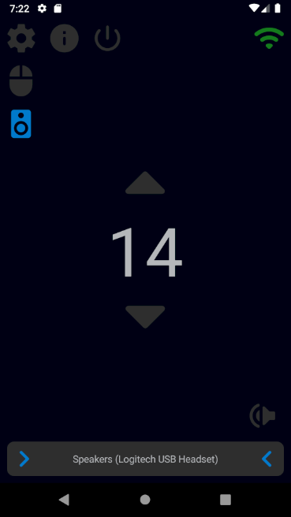

<h1 align="center">
  
   
  Remote Control Client
</h1>

**Remote Control Client** is an Android mobile application which together with [Remote Control Server](https://github.com/Tum4ik/remote-control-server) provides a possibility to control your PC via smartphone.

To be able to use this application you also need to install [Remote Control Server](https://github.com/Tum4ik/remote-control-server) on your PC.

## Features
* Mouse actions control
* System volume control

## Screenshots and functionality description

### Touch Pad Screen
<table>
  <tr>
    <td width="500px"></td>
    <td valign="top">
      <ul>
        <li>Connection state control</li>
        <li>Mouse pointer control</li>
        <li>Tap on the touch surface produces a mouse left button click</li>
        <li>Mouse left, middle and right buttons control</li>
        <li>Mouse scroll control</li>
      </ul>
    </td>
  </tr>
</table>

### Volume Control Screen
<table>
  <tr>
    <td width="500px"></td>
    <td valign="top">
      <ul>
        <li>Volume level control via buttons pressing or scrolling up and down</li>
        <li>Mute/unmute</li>
        <li>Volume output device selection</li>
      </ul>
    </td>
  </tr>
</table>

### Settings Screen
<table>
  <tr>
    <td width="500px"></td>
    <td valign="top">
      <ul>
        <li>Language selection (English, Russian, Ukrainian)</li>
        <li>Enable/Disable automatic connection establishment on the application startup</li>
        <li>Connection settings</li>
      </ul>
    </td>
  </tr>
</table>

### Info Screen
<table>
  <tr>
    <td width="500px"></td>
    <td valign="top">
      <ul>
        <li>Some information about the application</li>
      </ul>
    </td>
  </tr>
</table>
