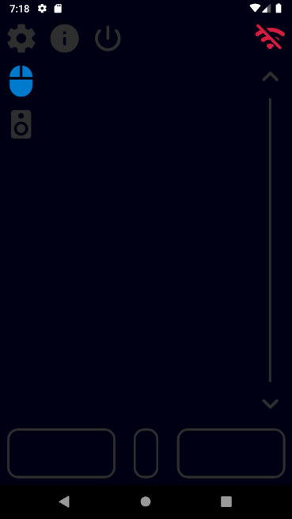
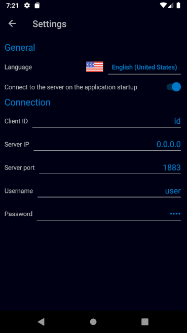
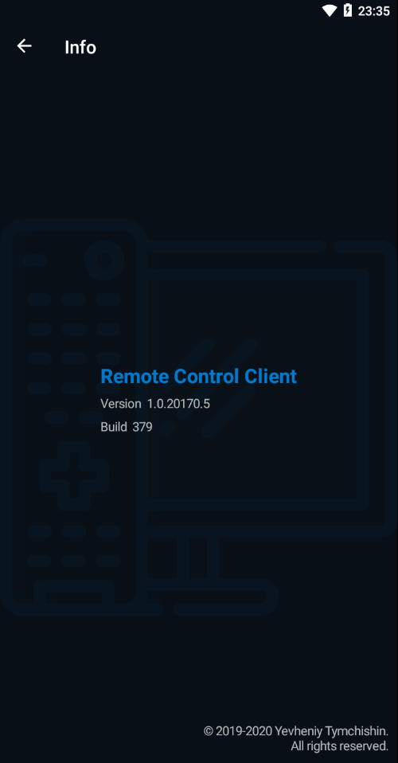

  
  

  

# Remote Control Client

To be able to use this application you also need to install [Remote Control Server](https://github.com/Tum4ik/remote-control-server) on your PC.

## Touch Pad Screen
<table>
  <tr>
    <td width="500px"></td>
    <td valign="top">
      <ul>
        <li>Control connection state</li>
        <li>Mouse pointer control</li>
        <li>Tap on the touch surface produces a mouse left button click</li>
        <li>Mouse left, middle and right buttons control</li>
        <li>Mouse scroll control</li>
      </ul>
    </td>
  </tr>
</table>

## Settings Screen
<table>
  <tr>
    <td width="500px"></td>
    <td valign="top">
      <ul>
        <li>Language selection (English, Russian, Ukrainian)</li>
        <li>Enable/Disable automatic connection establishment on the application startup</li>
        <li>Connection settings</li>
      </ul>
    </td>
  </tr>
</table>

## Info Screen
<table>
  <tr>
    <td width="500px"></td>
    <td valign="top">
      <ul>
        <li>Some information about the application</li>
      </ul>
    </td>
  </tr>
</table>
